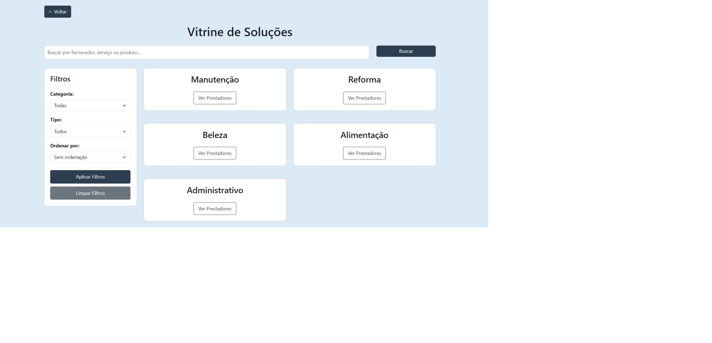
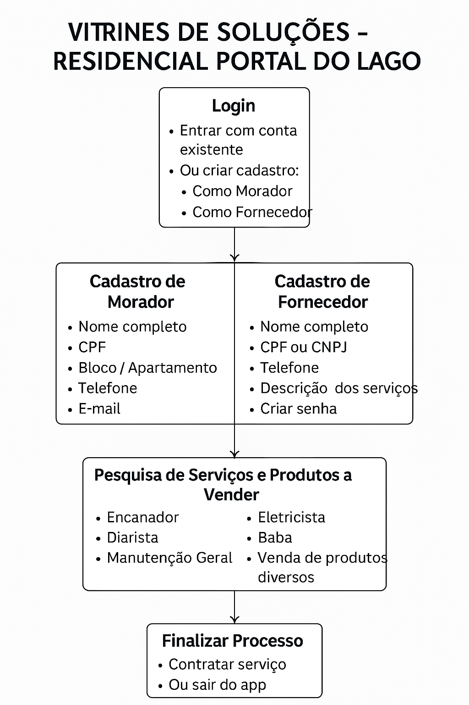

<h3>Projeto Integrador em Computação I - 2025</h3>

**Polos: Sumaré, Indaiatuba, Campo Limpo Paulista, Mogi Mirim e Americana**  

**Orientadora do PI: Maria Vitória Soares Lima**  

| Integrantes do grupo:                 |
| :------------------------------------ |
|ALEXANDRE DOS REIS, 23215840           |
|ANDRE PERANTONI GUIGEN, 23207477       |
|ELITON MAURO NACHBAR, 23207355         |
|FELIPHE GOMES TEBALDE, 23209995        |
|FLAVIO JORGE DE MEDEIROS, 23205233     |
|JOAO FELIPE B. BRANDAO, 23201444       |
|RODRIGO MARQUES DA SILVA, 22222722     |

 

<h4> 📚 PROJETO VITRINE COMUNITÁRIA DIGITAL: SISTEMA WEB PARA OFERTA DE SERVIÇOS E PRODUTOS EM CONDOMÍNIOS</h4>

---

 🟡 Sobre o problema encontrado

   
  

    Trata-se da falta de um canal de informação que torne acessível atender as necessidades dos moradores no que tange o aspecto de produtos e de serviços.
  

 

  

---
---

 🟡 Sobre a solução implementada

   

A solução encontrada foi o desenvolvimento de um sistema de API (Application Programming Interface), para implementar um canal de comunicação que permita oferecer produtos e serviços dentro do condomínio, atendendo às necessidades dos moradores.
Em outras palavras, é transformar o condomínio em um ambiente mais funcional, conectado e colaborativo, onde os moradores tenham suas necessidades atendidas de forma prática, segura e eficiente, enquanto fortalecem os laços comunitários e adotam práticas mais sustentáveis
.

---
---

 🟡 Estrutura do projeto

   
  Workflow do Funcionamento e Modelagem de Relacionamento de Banco de Dados  
  
   

  

---
---

 🟡 Como rodar o projeto

   
 Clonar o projeto para a maquina local: <code>git clone...</code>
  
  
 
 Instalar as packages:

---
